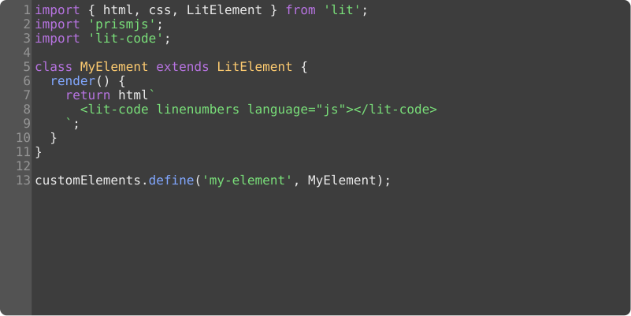

[](https://badge.fury.io/js/lit-code)
[](https://travis-ci.com/Demiler/lit-code)
[](https://www.webcomponents.org/element/lit-code)
[](https://bundlephobia.com/result?p=lit-code)


# lit-code
Simple browser code editor for small code chunks.  
Written with web-components and [lit](https://lit.dev/) library.  
Inspired by [CodeFlask](https://github.com/kazzkiq/CodeFlask).  

[DEMO](https://demiler.github.io/lit-code/)



# Features
+ Web component
+ Keeps your last line indentetion
+ Auto closing brackets, quotes
+ Indents line with the Tab key

# Installation
```
npm i lit-code
```
Requires lit library and if you want highlight prismjs aswell.

# Usage
Import it like this
```js
import 'prismjs'; //to enable code highlight
//or import './my-version-of-prism.js'
import 'lit-code'; //component it self
```
Use it like any other custom element!
```html
<lit-code></lit-code>
```

### options
+ `linenumbers` - add line numbers
+ `noshadow` - disables element's shadow-dom so you can sepcify your own colorscheme
+ `mycolors` - disables buildin theme for highlight
+ `code` - set pre existing code
+ `language` - set language (must exists in Prism package)
+ `grammar` - grammar for you language (sets automaticaly with any change of `language`);
 
That's how you can use them:
```html
<lit-code
    language='python'
    code='print("Hello, world!")'
    grammar=${Prism.languages.python}
    noshadow
    mycolors
    linenumbers
><lit-code>
```

# API
To get any code updates use `@update` as event listener. That will proved you with latests changes in code:
```html
<lit-code
    @update=${
        ({ detail: code }) => console.log('Hey, I\'ve got some new code:', code)
    }
></lit-code>
```
Or you can grab code with `.getCode()`  

To set some code at runtime use `.setCode()`.

# Styling
`lit-code` by default (as css vars) support `js`, `clike`, `html` and `css` hightlight.
Also `lit-code` keeps it self safe in comfy shadom-dom but you can still
specify various colors to it via css variables:
```css
--font-family: monospace;
--font-size:   12pt;
--line-height: 14pt;
--lines-width: 40px;

--editor-bg-color:    white;
--editor-text-color:  black;
--editor-caret-color: var(--editor-text-color);
--editor-sel-color:   #b9ecff;

--lines-bg-color:     #eee;
--lines-text-color:   black;
--scroll-track-color: #aaa;
--scroll-thumb-color: #eee;

/*lit-theme colors for default highlight tokens */
--hl-color-string:      #00ae22;
--hl-color-function:    #004eff;
--hl-color-number:      #dd9031;
--hl-color-operator:    #5a5a5a;
--hl-color-class-name:  #78c3ca;
--hl-color-punctuation: #4a4a4a;
--hl-color-keyword:     #8500ff;
--hl-color-comment:     #aaa;
```

These are default editor and highlight colors but you can spice things up 
by adding your own highlight with your `Prism` pacakge, disabling shadow-dom and
creating new highlight colorscheme:
```js
import './my-version-of-prism-with-cpp.js';
import 'lit-code';
```
```html
<lit-code language='cpp' noshadow></lit-code>
```
```css
.litcode {
    --editor-bg-color: black;
    --editor-text-color: white;
}
.litcode .token.type { color: red; }
.litcode .token.template { color: yellow; }
```

## Pro tip
For easy access to parsed by prismjs words hold `ctrl` + `shift`
while inspecting highlight with dev tools

# Example
```js
import { html, css, LitElement } from 'lit';
import 'prismjs';
import 'lit-code';

class JsCodePlayground extends LitElement {
  static styles = css`
    pre, lit-code {
      max-height: 300px;
      border-radius: 8px;
      border: 2px solid #eee;
    }
  `;

  static properties = {
    output: { type: String }
  };

  render() {
    return html`
      <lit-code linenumbers language='js'></lit-code>
      <button @click=${this.runCode}>Run code</button>
      <pre id="output">${this.output}</pre>
    `;
  }

  runCode() {
    const oldLog = console.log;
    console.log = (...args) => { this.output += args.join(' ') + '\n'; }
    this.output = '';
    const code = this.shadowRoot.querySelector('lit-code').getCode();
    eval(code); //eval is used only for demonstration purposes
    console.log = oldLog;
  }
};

customElements.define('js-code-playground', JsCodePlayground);
```
